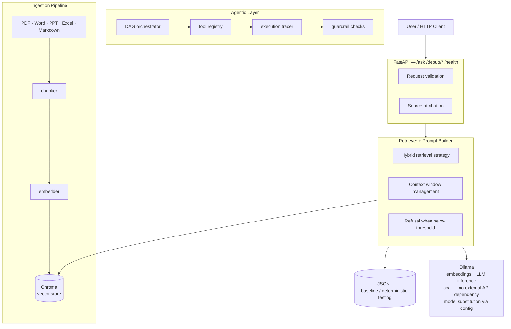

# AIStudio

> A hands-on AI engineering lab exploring production-relevant patterns 
> for LLM-enabled systems — local RAG, agentic workflows, observability, 
> and cloud-ready architecture.

---

## About This Project

This is a personal engineering lab, not production software. I built it 
to stay hands-on with the stack I reason about professionally — and to 
develop informed opinions about what actually holds up under real 
operational constraints versus what looks good in a demo.

The work here directly informs how I think about AI architecture 
decisions: where RAG breaks down, how agentic workflows fail, what 
observability actually requires in an LLM system, and how local and 
cloud deployments differ in practice.

If you're reviewing this as part of evaluating my background: the goal 
isn't to show production-grade software. It's to show that I engage with 
these systems at the implementation level, not just the whiteboard level.

---

## On Agent Architecture

The current wave of managed agent platforms — Claude's computer use, 
OpenAI Operator, Microsoft Copilot Studio — abstracts away the 
implementation details. That's useful for adoption. It also means most 
people building on top of them don't understand what's happening 
underneath: how tool boundaries work, where context windows become a 
constraint, why agents fail on ambiguous inputs, and what observability 
you lose when orchestration is managed for you.

This lab was built specifically to work at that lower level — to 
understand the failure modes before relying on the abstractions. The 
agentic workflows here are deliberately constructed without managed 
platforms: explicit tool definitions, traced execution, documented 
failure cases.

The goal is substrate knowledge, not API consumption.

---

## What's Here

### Local Knowledge Engine (RAG)
- Embedding-based retrieval using Chroma vector store
- Open-source LLMs via Ollama — no external API dependency
- Incremental document ingestion: PDF, Word, PowerPoint, Excel, Markdown
- FastAPI `/ask` endpoint with source-aware answers
- JSONL baseline for deterministic testing without embeddings
- Explicit refusal behavior when context is insufficient

### Agentic Lab
- Tool-using agent workflows: RAG queries, file I/O, summarization
- DAG-based orchestration for multi-step pipelines
- Execution tracing and guardrail layers
- Documented failure modes — built to understand where autonomy 
  breaks down, not just where it works

### Engineering Discipline
- CI/CD via GitHub Actions
- Pre-commit hooks and code quality checks
- Reproducible setup via bootstrap script
- Separation between debug artifacts and production-style components

---

## Architecture

---

## Why These Choices

See [Architecture Decisions](docs/architecture_decisions.md) for the 
reasoning behind key technical choices — vector store selection, 
local-first design, orchestration approach, and what I would change 
for a production deployment at scale.

---

## Point of View

For the broader strategic context behind this work — how agentic AI 
is evolving, where its current limitations actually lie, and what 
that means for financial services specifically — see:

**[Agentic AI in Financial Services: Some Reflections](docs/agentic_ai_pov.pdf)**

This document explores the transition from descriptive to generative 
to agentic AI, the practical constraints on autonomous systems today, 
and a framework for thinking about where AI adds durable value versus 
where human judgment remains irreplaceable. Written December 2025.

---

## Quickstart

See [QUICKSTART.md](QUICKSTART.md) to get a running `/ask` endpoint 
in under 10 minutes.

---

## Roadmap

**In progress**
- Corpus management with named corpora and include/exclude rules
- Guardrails: path allow-lists, redaction, refusal policies
- Usage metering and observability dashboard

**Planned**
- Cloud deployment on AWS (ECS + S3-backed vector store)
- Comparison of local vs. cloud latency and cost tradeoffs
- Multi-step agent demo with documented execution traces
- LiteLLM integration for unified provider abstraction

---

## Stack

Python · FastAPI · Ollama · Chroma · GitHub Actions · AWSAIStudio

