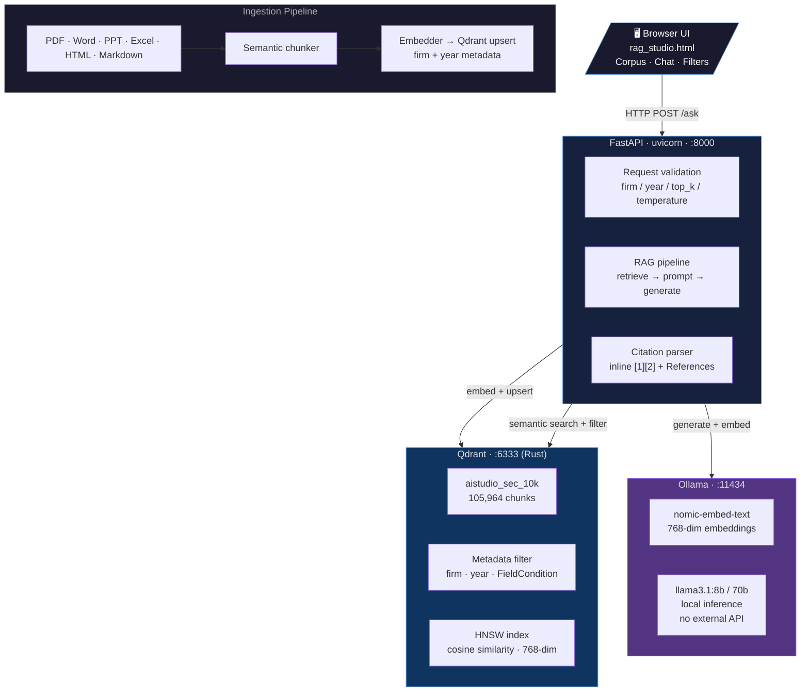
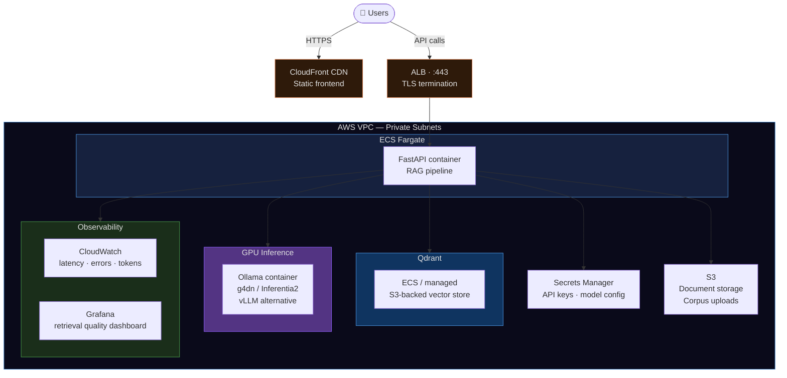

# AIStudio

> A hands-on AI engineering lab exploring production-relevant patterns
> for LLM-enabled systems — local RAG, metadata filtering, observability,
> and scalable vector architecture on Apple Silicon.

---

## What This Does

AIStudio gives you a **private, local search engine over your own documents** —
running entirely on your Mac, with no data leaving your machine and no external
API dependency.

**What you actually see and do:**

A browser-based interface lets you manage document collections and query
them conversationally. Three main areas:

- **Corpus Manager** — create named collections of documents, upload PDFs,
  Word docs, PowerPoints, Excel files, or Markdown, and trigger indexing.
  Each corpus is independently searchable.

- **Chat Interface** — ask questions in plain English and get answers grounded
  in your documents, with inline source citations (`[1]`, `[2]`) and a
  References section showing exactly which document and passage each answer
  came from.

- **Filters** — optional firm and year filters narrow retrieval to a specific
  source before the query runs. Filtering happens at the vector layer — not
  post-hoc on results.

**Flagship corpus:** 143 SEC 10-K filings from 25 financial services firms
(Goldman Sachs, JPMorgan Chase, Morgan Stanley, BlackRock, and others),
105,964 chunks, ingested in 34 minutes at 54 chunks/sec on an M4 MacBook Pro.

**On performance:** Warm `llama3.1:70b` and warm `llama3.1:8b` are
statistically identical in query latency on Apple Silicon (~6–7s average).
Once loaded into unified memory, model size stops being a latency variable.
See [BENCHMARK_FINDINGS.md](BENCHMARK_FINDINGS.md).

---

## Current Status

Core RAG loop working end-to-end on a 106K-chunk production corpus.
Qdrant vector store (Rust-based) replaced ChromaDB after ChromaDB crashed
at 32K chunks. Metadata filtering (firm, year) implemented end-to-end —
backend, API, and UI.

**Working today:**
- Document ingestion: PDF, Word, PowerPoint, Excel, Markdown, HTML
- Vector search via Qdrant 1.17.0 with cosine similarity
- Metadata filtering — firm and year filters on retrieval
- RAG query with inline citations and source references
- Browser UI — corpus selector, model selector, parameters, filters, chat
- FastAPI backend — `/ask`, `/health`, `/corpus/*`, `/debug/*` endpoints
- Auto-launch script — `scripts/start.sh` starts all four processes
- Benchmark harness — `scripts/benchmark.py` with CLI flags, auto-generates findings

**In progress:**
- Reranker (CrossEncoder) for vocabulary mismatch in retrieval
- Relevance threshold — discard low-scoring chunks
- XBRL noise stripping in HTML ingestion
- PDF viewer with click-to-source citation

---

## Architecture — Local (Current)


```mermaid
flowchart TD
    UI[/"🖥 Browser UI\nrag_studio.html\nCorpus · Chat · Filters"/]

    UI -->|HTTP POST /ask| API

    subgraph API["FastAPI · uvicorn · :8000"]
        AV["Request validation\nfirm / year / top_k / temperature"]
        AR["RAG pipeline\nretrieve → prompt → generate"]
        AC["Citation parser\ninline [1][2] + References"]
    end

    API -->|embed + upsert| QD
    API -->|semantic search + filter| QD
    API -->|generate + embed| OL

    subgraph QD["Qdrant · :6333 (Rust)"]
        QC["aistudio_sec_10k\n105,964 chunks"]
        QF["Metadata filter\nfirm · year · FieldCondition"]
        QH["HNSW index\ncosine similarity · 768-dim"]
    end

    subgraph OL["Ollama · :11434"]
        OE["nomic-embed-text\n768-dim embeddings"]
        OM["llama3.1:8b / 70b\nlocal inference\nno external API"]
    end

    subgraph ING["Ingestion Pipeline"]
        IN["PDF · Word · PPT · Excel · HTML · Markdown"]
        CH["Semantic chunker"]
        EM["Embedder → Qdrant upsert\nfirm + year metadata"]
        IN --> CH --> EM
    end

    style UI fill:#1a1a2e,stroke:#4a90d9,color:#ffffff
    style API fill:#16213e,stroke:#4a90d9,color:#e0e0e0
    style QD fill:#0f3460,stroke:#4a90d9,color:#e0e0e0
    style OL fill:#533483,stroke:#8b5cf6,color:#e0e0e0
    style ING fill:#1a1a2e,stroke:#555,color:#aaaaaa
```

**Why Qdrant over ChromaDB:**

| | ChromaDB | Qdrant |
|--|---------|--------|
| Stability at scale | Crashed at 32K chunks | Stable at 106K chunks |
| Language | Python | Rust |
| Metadata filtering | Limited | Native Filter/FieldCondition |
| Memory model | Python GC | Rust ownership, near-zero overhead |
| Production path | Single-node | Sharding, replication, quantization |
| gRPC | No | Yes (port 6334) |

---

## Architecture — Cloud (v2.0 Roadmap)

The local four-process pattern maps directly to a containerized cloud deployment.
Each process becomes a container; Qdrant and Ollama have official Docker images.


```mermaid
flowchart TD
    Users(["👤 Users"])
    CDN["CloudFront CDN\nStatic frontend"]
    ALB["ALB · :443\nTLS termination"]

    Users -->|HTTPS| CDN
    Users -->|API calls| ALB

    subgraph VPC["AWS VPC — Private Subnets"]
        subgraph ECS["ECS Fargate"]
            API["FastAPI container\nRAG pipeline"]
        end

        subgraph QDRANT["Qdrant"]
            QC["ECS / managed\nS3-backed vector store"]
        end

        subgraph INFERENCE["GPU Inference"]
            OL["Ollama container\ng4dn / Inferentia2\nvLLM alternative"]
        end

        subgraph OBS["Observability"]
            CW["CloudWatch\nlatency · errors · tokens"]
            GR["Grafana\nretrieval quality dashboard"]
        end

        SM["Secrets Manager\nAPI keys · model config"]
        S3["S3\nDocument storage\nCorpus uploads"]
    end

    ALB --> API
    API --> QDRANT
    API --> INFERENCE
    API --> OBS
    API --> SM
    API --> S3

    style VPC fill:#0a0a1a,stroke:#4a90d9,color:#e0e0e0
    style ECS fill:#16213e,stroke:#4a90d9,color:#e0e0e0
    style QDRANT fill:#0f3460,stroke:#4a90d9,color:#e0e0e0
    style INFERENCE fill:#533483,stroke:#8b5cf6,color:#e0e0e0
    style OBS fill:#1a2e1a,stroke:#4a9d4a,color:#e0e0e0
    style CDN fill:#2e1a0a,stroke:#d97b4a,color:#e0e0e0
    style ALB fill:#2e1a0a,stroke:#d97b4a,color:#e0e0e0
```

**Local → cloud is a container boundary, not an architecture change.**
Same FastAPI app, same Qdrant queries, same Ollama interface — wrapped in
Docker and deployed to ECS Fargate. No code changes required.

---

## About This Project

This is a personal engineering lab, not production software. Built to stay
hands-on with the stack I reason about professionally — and to develop
informed opinions about what actually holds up under real operational
constraints versus what looks good in a demo.

If you're reviewing this as part of evaluating my background: the goal
isn't to show production-grade software. It's to show that I engage with
these systems at the implementation level, not just the whiteboard level.

The architecture choices — Qdrant over ChromaDB, four-process separation,
metadata filtering at the vector layer — are deliberate and documented in
[docs/architecture_decisions.md](docs/architecture_decisions.md).

---

## Quickstart

See [QUICKSTART.md](QUICKSTART.md) to get a running instance in under 30 minutes.

**TL;DR for experienced users:**
```bash
# 1. Install Qdrant (not in Homebrew — binary install required)
curl -L https://github.com/qdrant/qdrant/releases/latest/download/qdrant-aarch64-apple-darwin.tar.gz | tar xz
mkdir -p ~/bin && mv qdrant ~/bin/qdrant && echo 'export PATH="$HOME/bin:$PATH"' >> ~/.zshrc && source ~/.zshrc

# 2. Clone and set up
git clone git@github.com:mbarberony/AIStudio.git && cd AIStudio
python3.13 -m venv .venv && source .venv/bin/activate
pip install -r requirements.txt

# 3. Start everything
~/Developer/AIStudio/scripts/start.sh

# 4. Open UI
open front_end/rag_studio.html
```

---

## Benchmark

```
Corpus:     143 SEC 10-K filings, 25 financial services firms
Chunks:     105,964
Ingest:     34 min, 54 chunks/sec, 0 failures
Latency:    ~6–7s warm (8b and 70b identical on Apple Silicon)
Filtering:  firm + year metadata filters, zero latency overhead
ChromaDB:   crashed at 32,285 chunks
Qdrant:     stable at 105,964 chunks
```

See [BENCHMARK_FINDINGS.md](BENCHMARK_FINDINGS.md) for full analysis including
cold vs warm latency breakdown and cross-model comparison.

---

## Point of View

**[Agentic AI in Financial Services: Some Reflections](docs/agentic_ai_pov.pdf)**

Explores the transition from descriptive to generative to agentic AI, the
practical constraints on autonomous systems today, and a framework for thinking
about where AI adds durable value versus where human judgment remains
irreplaceable. Written December 2025.

---

## Roadmap

See [docs/roadmap.md](docs/roadmap.md) for the full phased plan.

**Next milestones:**
- Reranker (CrossEncoder ms-marco-MiniLM) — fixes vocabulary mismatch in retrieval
- Relevance threshold — discard chunks below similarity cutoff
- Page-aware chunking + PDF viewer — click citation → scroll to source page
- MacBook Air end-to-end validation
- Containerization + AWS ECS deployment (v2.0)

---

## Stack

Python · FastAPI · Qdrant · Ollama · llama3.1 · nomic-embed-text · Docker (v2.0) · AWS ECS (v2.0)
