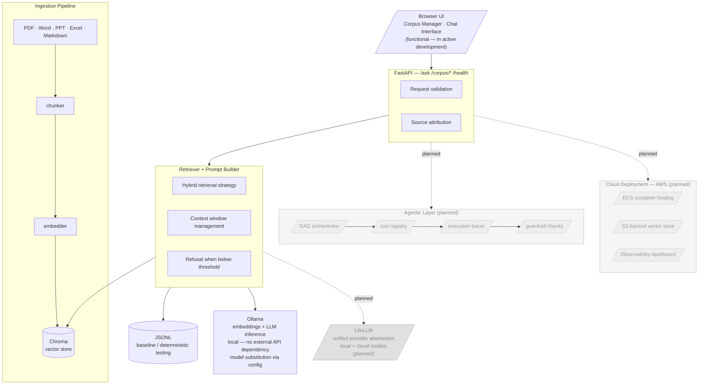

# AIStudio

> A hands-on AI engineering lab exploring production-relevant patterns 
> for LLM-enabled systems — local RAG, agentic workflows, observability, 
> and cloud-ready architecture.

---

## What This Does

AIStudio gives you a **private, local search engine over your own documents** — 
running entirely on your Mac, with no data leaving your machine and no external 
API dependency.

**What you actually see and do:**

A browser-based interface lets you manage your document collections and query 
them conversationally. There are two main areas:

- **Corpus Manager** — create named collections (corpora) of documents, upload 
  PDFs, Word docs, PowerPoints, Excel files, or Markdown, and trigger indexing. 
  Each corpus is independently searchable.

- **Chat Interface** — a conversational window where you ask questions in plain 
  English and get answers grounded in your documents, with inline source 
  citations (`[1]`, `[2]`) and a References section showing exactly which 
  document and passage each answer came from.

The practical result: ask "what are the limitations of agentic AI?" or 
"summarize the risk section of the Q3 board deck" — and get a sourced answer 
from your own files, not from the internet, with no data ever leaving your machine.

**On performance:** AIStudio has been developed and tested on an Apple M4 Max 
MacBook Pro with 128GB unified memory. This hardware can run 70-billion parameter 
models entirely in memory — something that previously required a dedicated GPU 
server. Warm query latency on llama3.1:70b is approximately 9–17 seconds. Most 
users will run smaller models (8b) and see faster responses. The architecture is 
model-agnostic: swap models by changing a single config line.

---

## Current Status — Alpha

Core query functionality is working end-to-end. Some UI controls are still being 
wired up (see Roadmap).

**Working today:**
- Document ingestion (PDF, Word, PowerPoint, Excel, Markdown)
- Vector search via Chroma with embedding-based retrieval
- RAG query with inline citations and source references
- Browser UI — corpus selector, query interface, corpus stats
- FastAPI backend with health, query, and corpus management endpoints
- Model selection via config (any Ollama-hosted model)

**In progress for beta:**
- Automatic re-indexing after file upload
- Corpus and file deletion via UI
- Model switcher in UI (currently config-only)
- Response time telemetry in UI

---

## About This Project

This is a personal engineering lab, not production software. I built it 
to stay hands-on with the stack I reason about professionally — and to 
develop informed opinions about what actually holds up under real 
operational constraints versus what looks good in a demo.

If you're reviewing this as part of evaluating my background: the goal 
isn't to show production-grade software. It's to show that I engage with 
these systems at the implementation level, not just the whiteboard level.

---

## On Agent Architecture

The current wave of managed agent platforms — Claude's computer use, 
OpenAI Operator, Microsoft Copilot Studio — abstracts away the 
implementation details. That's useful for adoption. It also means most 
people building on top of them don't understand what's happening 
underneath: how tool boundaries work, where context windows become a 
constraint, why agents fail on ambiguous inputs, and what observability 
you lose when orchestration is managed for you.

This lab was built specifically to work at that lower level — to 
understand the failure modes before relying on the abstractions.

The goal is substrate knowledge, not API consumption.

---

## What's Here

### Local Knowledge Engine (RAG)
- Embedding-based retrieval using Chroma vector store
- Open-source LLMs via Ollama — no external API dependency
- Incremental document ingestion: PDF, Word, PowerPoint, Excel, Markdown
- FastAPI `/ask` endpoint with source-aware answers and inline citations
- JSONL baseline for deterministic testing without embeddings
- Explicit refusal behavior when context is insufficient

### Agentic Lab
- Tool-using agent workflows: RAG queries, file I/O, summarization
- DAG-based orchestration for multi-step pipelines
- Execution tracing and guardrail layers
- Documented failure modes — built to understand where autonomy 
  breaks down, not just where it works

### Engineering Discipline
- Pre-commit hooks and code quality checks
- Reproducible setup via virtual environment and requirements file
- Separation between debug artifacts and production-style components

---

## Architecture

The diagram below shows the full intended architecture. **Solid nodes are 
deployed and running locally today.** Greyed nodes are on the roadmap.

```mermaid
flowchart TD
    U[/"Browser UI\nCorpus Manager · Chat Interface\n(functional — in active development)"/]
    U --> API

    subgraph API["FastAPI — /ask  /corpus/*  /health"]
        AV[Request validation]
        AS[Source attribution]
    end

    API --> RPB

    subgraph RPB["Retriever + Prompt Builder"]
        RH[Hybrid retrieval strategy]
        RC[Context window management]
        RR[Refusal when below threshold]
    end

    RPB --> C
    RPB --> J
    RPB --> O
    RPB -.->|planned| L

    C[(Chroma\nvector store)]
    J[(JSONL\nbaseline / deterministic testing)]
    O[Ollama\nembeddings + LLM inference\nlocal — no external API dependency\nmodel substitution via config]

    L[/"LiteLLM\nunified provider abstraction\nlocal + cloud models\n(planned)"/]

    subgraph AG["Agentic Layer (planned)"]
        DAG[/"DAG orchestrator"/] --> TR[/"tool registry"/]
        TR --> ET[/"execution tracer"/]
        ET --> GC[/"guardrail checks"/]
    end

    subgraph ING["Ingestion Pipeline"]
        IN[PDF · Word · PPT · Excel · Markdown] --> CH[chunker]
        CH --> EM[embedder]
        EM --> C
    end

    subgraph CLOUD["Cloud Deployment — AWS (planned)"]
        ECS[/"ECS container hosting"/]
        S3[/"S3-backed vector store"/]
        OBS[/"Observability dashboard"/]
    end

    API -.->|planned| AG
    API -.->|planned| CLOUD

    style L fill:#e0e0e0,stroke:#aaaaaa,color:#888888
    style AG fill:#f5f5f5,stroke:#bbbbbb,color:#888888
    style DAG fill:#eeeeee,stroke:#cccccc,color:#999999
    style TR fill:#eeeeee,stroke:#cccccc,color:#999999
    style ET fill:#eeeeee,stroke:#cccccc,color:#999999
    style GC fill:#eeeeee,stroke:#cccccc,color:#999999
    style CLOUD fill:#f5f5f5,stroke:#bbbbbb,color:#888888
    style ECS fill:#eeeeee,stroke:#cccccc,color:#999999
    style S3 fill:#eeeeee,stroke:#cccccc,color:#999999
    style OBS fill:#eeeeee,stroke:#cccccc,color:#999999
```

---

## Why These Choices

See [Architecture Decisions](docs/architecture_decisions.md) for the 
reasoning behind key technical choices — vector store selection, 
local-first design, orchestration approach, and what I would change 
for a production deployment at scale.

---

## Point of View

**[Agentic AI in Financial Services: Some Reflections](docs/agentic_ai_pov.pdf)**

Explores the transition from descriptive to generative to agentic AI, the 
practical constraints on autonomous systems today, and a framework for thinking 
about where AI adds durable value versus where human judgment remains 
irreplaceable. Written December 2025.

---

## Quickstart

See [QUICKSTART.md](QUICKSTART.md) to get a running instance in under 20 minutes.

---

## Roadmap

**Alpha (current)**
- Core RAG query with citations ✅
- Corpus management via UI ✅
- Automatic re-indexing after file upload
- Corpus and file deletion via UI
- Response time telemetry

**Beta**
- Model switcher in UI
- 10–20 file corpus validation
- Clear Conversation and context controls
- Ribbon navigation replacing sidebar

**v1.0**
- 10–50 file corpus support validated
- One-click installer (.dmg)
- Automated test suite
- Windows support

---

## Stack

Python · FastAPI · Ollama · Chroma · GitHub Actions · AWS
