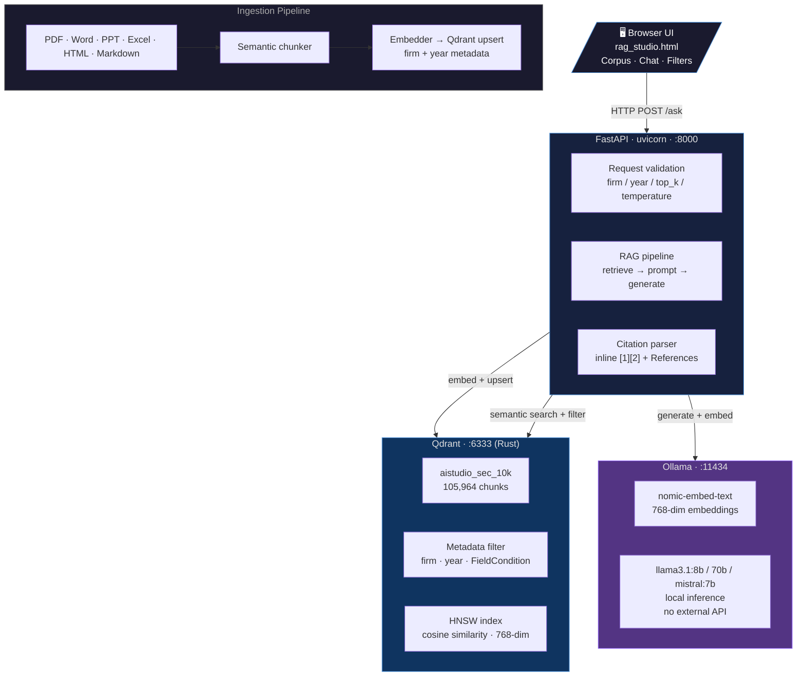

[](https://github.com/mbarberony/AIStudio/actions/workflows/ci.yml)

# AIStudio

**AIStudio is a private, local AI search and RAG (Retrieval-Augmented Generation) application that runs entirely on your Mac.** It lets you upload your own documents, index them, and ask questions in plain English — getting cited answers grounded in your content, with no data leaving your machine and no external API or cloud dependency.

AIStudio is what you use when you want to query your own documents with AI. It is not a general-purpose chatbot — it is a document intelligence system. You bring the documents; AIStudio finds the answers.

> *AIStudio is a hands-on AI engineering lab for exploring how LLM-enabled systems behave under real operational constraints — retrieval quality, vocabulary mismatch, metadata filtering, observability, and deployment trade-offs — before those issues get hidden behind abstractions.*
>
> **Current stack:** Python · FastAPI · local Ollama inference · Qdrant vector storage · llama3.1 · mistral · nomic-embed-text · sentence-transformers · pdfplumber page-aware PDF extraction · CrossEncoder reranker · benchmark harness · CI/CD pipeline · Docker (v3.0) · AWS ECS (v3.0)
>
> The architecture choices are deliberate and documented. See [docs/architecture_decisions.md](docs/architecture_decisions.md). For a guide to how the codebase is organized, see [docs/CODEBASE_GUIDE.md](docs/CODEBASE_GUIDE.md).

---

## Point of View

**[Agentic AI in Financial Services: Some Reflections](docs/agentic_ai_pov.pdf)**

This work is one aspect of the author's work in AI. It explores the transition from descriptive to generative to agentic AI, the practical constraints on autonomous systems today, and a framework for thinking about where AI adds durable value versus where human judgment remains irreplaceable. Written December 2025.

---

## What This Does

AIStudio gives you a **private, local search engine over your own documents** — running entirely on your Mac, with no data leaving your machine and no external API dependency.

### What you actually see and do

A browser-based interface lets you manage document collections and query them conversationally. Three main areas:

- **Corpus Manager** — create named collections of documents, upload PDFs, Word docs, PowerPoints, Excel files, or Markdown, and trigger indexing. Each corpus is independently searchable.

- **Chat Interface** — ask questions in plain English and get answers grounded in your documents, with inline source citations (`[1]`, `[2]`) and a References section showing exactly which document and passage each answer came from.

- **Filters** — optional firm and year filters narrow retrieval to a specific source before the query runs. Filtering happens at the system (vector) layer — not post-hoc on results.

**Two corpora ship with AIStudio, each proving something different:**

**Demo corpus — 20 years of original thought leadership:** AIStudio ships with a curated set of 15 documents spanning 2003–2021 — IT strategy frameworks, enterprise architecture methodology, financial services technology journals, cloud migration analysis, and AI reference architecture. These are original works: articles edited for practitioner journals, engagement frameworks, and strategy documents produced across senior technology roles at major financial institutions. Querying this corpus is querying the intellectual capital of a 20-year career. The corpus and the tool are the same proof point.

A reviewer who asks *"What is the relationship between business strategy and technology strategy?"* gets a grounded, cited answer from a 2006 FS Journal article — original work, not sample data. That is what makes the demo corpus distinctive.

**AIStudio as its own corpus:** AIStudio's documentation — architecture decisions, benchmark methodology, retrieval guides — is available as a corpus in the standard interface. Asking *"What embedding model does AIStudio use?"* or *"How does the reranker work?"* returns cited answers from the actual codebase docs. The tool documents itself.

**On performance:** Warm `llama3.1:70b` and warm `llama3.1:8b` are statistically identical in query latency on Apple Silicon (~6–7s average). Once loaded into unified memory, model size stops being a latency variable. See [benchmarks/](benchmarks/) for the full benchmark harness and timestamped reports.

The [QUICKSTART](QUICKSTART.md) also shows you how to set up the **SEC 10-K corpus** to demonstrate how AIStudio can operate at scale — exploring 143 annual filings from 25 financial services firms (Goldman Sachs, JPMorgan Chase, Morgan Stanley, BlackRock, and others), 105,964 chunks, ingested in 34 minutes at 54 chunks/sec on an M4 MacBook Pro. Due to their size, the files for this corpus are not shipped with the app but need to be downloaded from the SEC first. More importantly, ingesting and indexing this type of corpus provides a good opportunity to learn how to work with a large corpus.

---

## Quickstart

See [QUICKSTART.md](QUICKSTART.md) to get a running instance in under 30 minutes.

**TL;DR for experienced users:**
```bash
# 1. Install Qdrant (not in Homebrew — binary install required)
curl -L https://github.com/qdrant/qdrant/releases/latest/download/qdrant-aarch64-apple-darwin.tar.gz | tar xz
mkdir -p ~/bin && mv qdrant ~/bin/qdrant && echo 'export PATH="$HOME/bin:$PATH"' >> ~/.zshrc && source ~/.zshrc

# 2. Clone and set up
git clone git@github.com:mbarberony/AIStudio.git && cd AIStudio
./ais_install && source ~/.zshrc

# 3. Start everything (stops any running services first, then restarts clean)
ais_start

# 4. Open UI
open front_end/rag_studio.html
```

---

## Current Status

Core RAG loop working end-to-end on a 106K-chunk production corpus. Qdrant vector store (Rust-based) replaced ChromaDB after ChromaDB crashed at 32K chunks. Metadata filtering (firm, year) implemented end-to-end — backend, API, and UI. CI/CD pipeline green on every push.

### Working today

- Document ingestion: PDF, Word, PowerPoint, Excel, Markdown, HTML
- Vector search via Qdrant 1.17.0 with cosine similarity
- Metadata filtering — firm and year filters at the vector layer
- RAG query with inline citations and source references
- Browser UI — corpus selector, model selector, parameters, filters, chat
- FastAPI backend — `/ask`, `/health`, `/corpus/*`, `/debug/*` endpoints
- Auto-launch script — `scripts/start.sh` starts all four processes
- Benchmark harness — `benchmarks/benchmark.py` with CLI flags, auto-generates findings
- CI/CD — GitHub Actions: lint + unit + integration tests on every push
- Developer tooling — Makefile (`make check`, `make coverage`), pre-commit hooks

### Recently completed (Beta)

- CrossEncoder reranker (ms-marco-MiniLM) — fixes vocabulary mismatch ✅
- Page-aware PDF chunking via pdfplumber — page numbers in citations ✅
- PDF viewer — direct access to source page from inline citation ✅
- `--force` ingest flag — atomic wipe + clean re-index ✅
- YAML benchmark question files with corpus auto-detection ✅
- Demo corpus benchmark: 11/12 questions pass, 6.3s avg latency ✅

### In progress

- Relevance threshold — discard low-scoring chunks
- XBRL noise stripping in HTML ingestion
- Remove file from corpus UI

---

## Roadmap in a Nutshell

| Beta (now) | v2.0 | v3.0 |
|------------|------|------|
| ✅ CrossEncoder reranker | PDF viewer click → source page | Docker + AWS ECS Fargate |
| ✅ Page-aware PDF chunking | PDF image identification + citation | Multi-user + shared corpora |
| ✅ PDF viewer Open ↗ links | Clean install validation | GPU inference (Inferentia2) |
| ✅ `--force` atomic ingest | MacBook Air validation | Compiled installer (.dmg) |
| Relevance threshold | Benchmark comparison tooling | urCrew integration |

See [docs/PRODUCT_ROADMAP.md](docs/PRODUCT_ROADMAP.md) for the full phased plan. Releases go Beta → v2.0 → v3.0. There is no v1.0 by design.

---

## Architecture — Local (Current)


```mermaid
flowchart TD
    UI[/"🖥 Browser UI\nrag_studio.html\nCorpus · Chat · Filters"/]

    UI -->|HTTP POST /ask| API

    subgraph API["FastAPI · uvicorn · :8000"]
        AV["Request validation\nfirm / year / top_k / temperature"]
        AR["RAG pipeline\nretrieve → prompt → generate"]
        AC["Citation parser\ninline [1][2] + References"]
    end

    API -->|embed + upsert| QD
    API -->|semantic search + filter| QD
    API -->|generate + embed| OL

    subgraph QD["Qdrant · :6333 (Rust)"]
        QC["aistudio_sec_10k\n105,964 chunks"]
        QF["Metadata filter\nfirm · year · FieldCondition"]
        QH["HNSW index\ncosine similarity · 768-dim"]
    end

    subgraph OL["Ollama · :11434"]
        OE["nomic-embed-text\n768-dim embeddings"]
        OM["llama3.1:8b / 70b / mistral:7b\nlocal inference\nno external API"]
    end

    subgraph ING["Ingestion Pipeline"]
        IN["PDF · Word · PPT · Excel · HTML · Markdown"]
        CH["Semantic chunker"]
        EM["Embedder → Qdrant upsert\nfirm + year metadata"]
        IN --> CH --> EM
    end

    style UI fill:#1a1a2e,stroke:#4a90d9,color:#ffffff
    style API fill:#16213e,stroke:#4a90d9,color:#e0e0e0
    style QD fill:#0f3460,stroke:#4a90d9,color:#e0e0e0
    style OL fill:#533483,stroke:#8b5cf6,color:#e0e0e0
    style ING fill:#1a1a2e,stroke:#555,color:#aaaaaa
```

**Why Qdrant over ChromaDB:**

| | ChromaDB | Qdrant |
|--|---------|--------|
| Stability at scale | Crashed at 32K chunks | Stable at 106K chunks |
| Language | Python | Rust |
| Metadata filtering | Limited | Native Filter/FieldCondition |
| Memory model | Python GC | Rust ownership, near-zero overhead |
| Production path | Single-node | Sharding, replication, quantization |
| gRPC | No | Yes (port 6334) |

---

## Architecture — Cloud (v3.0 Roadmap)

The local four-process pattern maps directly to a containerized cloud deployment. Each process becomes a container; Qdrant and Ollama have official Docker images.


```mermaid
flowchart TD
    Users(["👤 Users"])
    CDN["CloudFront CDN\nStatic frontend"]
    ALB["ALB · :443\nTLS termination"]

    Users -->|HTTPS| CDN
    Users -->|API calls| ALB

    subgraph VPC["AWS VPC — Private Subnets"]
        subgraph ECS["ECS Fargate"]
            API["FastAPI container\nRAG pipeline"]
        end

        subgraph QDRANT["Qdrant"]
            QC["ECS / managed\nS3-backed vector store"]
        end

        subgraph INFERENCE["GPU Inference"]
            OL["Ollama container\ng4dn / Inferentia2\nvLLM alternative"]
        end

        subgraph OBS["Observability"]
            CW["CloudWatch\nlatency · errors · tokens"]
            GR["Grafana\nretrieval quality dashboard"]
        end

        SM["Secrets Manager\nAPI keys · model config"]
        S3["S3\nDocument storage\nCorpus uploads"]
    end

    ALB --> API
    API --> QDRANT
    API --> INFERENCE
    API --> OBS
    API --> SM
    API --> S3

    style VPC fill:#0a0a1a,stroke:#4a90d9,color:#e0e0e0
    style ECS fill:#16213e,stroke:#4a90d9,color:#e0e0e0
    style QDRANT fill:#0f3460,stroke:#4a90d9,color:#e0e0e0
    style INFERENCE fill:#533483,stroke:#8b5cf6,color:#e0e0e0
    style OBS fill:#1a2e1a,stroke:#4a9d4a,color:#e0e0e0
    style CDN fill:#2e1a0a,stroke:#d97b4a,color:#e0e0e0
    style ALB fill:#2e1a0a,stroke:#d97b4a,color:#e0e0e0
```

**Local → cloud (Release 2.0) is a container boundary, not an architecture change.** Same FastAPI app, same Qdrant queries, same Ollama interface — wrapped in Docker and deployed to ECS Fargate. No code changes required.

---

## Performance Findings

Synthesized from 15 benchmark runs on MacBook Pro M4 Max (128GB unified memory):

- **Sub-7s latency** per query once the model is warm — including complex multi-source synthesis
- **99.1% pass rate** across 108 Q/A pairs (9 runs × 12 questions, identical conditions)
- **Model size does not predict warm latency** — llama3.1:70b and llama3.1:8b both land at 6.9–7.2s; the bottleneck is output token generation, not parameter count
- **Retrieval adds ~0.3–0.5s** even at 105,964 chunks — inference, not retrieval, is the bottleneck
- **Stable across successive runs** — no thermal throttling or memory pressure observed

Testing spans the Apple Silicon performance spectrum: the M4 Max (128GB) establishes the baseline above. The same system runs correctly on an M4 Air — the other end of the Apple Silicon range — with approximately 40% higher latency under equivalent conditions. Systematic benchmark data on the Air is being collected. The goal is to characterize behavior across the full range of likely deployment hardware, not just optimal conditions.

→ [Full benchmark analysis and measurement methodology](llm_analysis/HELP%20-%20AIStudio%20-%20RAG%20Performance%20Findings%20-%202026-03-22.md)

---

## Benchmark

```
Corpus:     143 SEC 10-K filings, 25 financial services firms
Chunks:     105,964
Ingest:     34 min, 54 chunks/sec, 0 failures
Latency:    ~6–7s warm (8b and 70b identical on Apple Silicon)
Filtering:  firm + year metadata filters, zero latency overhead
ChromaDB:   crashed at 32,285 chunks
Qdrant:     stable at 105,964 chunks
```

See [benchmarks/](benchmarks/) for the full benchmark harness, timestamped reports, and question sets.

---

**Manuel Barbero** · [mbarberony@gmail.com](mailto:mbarberony@gmail.com) · [linkedin.com/in/mbarberony](https://www.linkedin.com/in/mbarberony) · [github.com/mbarberony/AIStudio](https://github.com/mbarberony/AIStudio)
