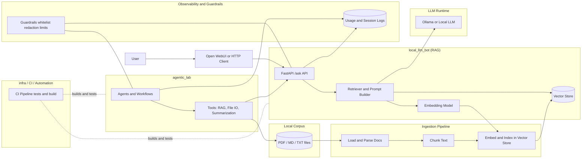

**AIStudio** is a modular AI engineering environment designed for exploring local LLM workflows, retrieval-augmented generation (RAG), agentic automation, observability, guardrails, and lightweight CI/CD practices.  
It serves as a personal laboratory for experimenting with modern AI architectures and engineering techniques in both **local** and **cloud-ready** contexts.





---

## Core Objectives

- Develop a **local knowledge engine** capable of answering questions across a private corpus using open-source LLMs and embeddings.
- Experiment with **agentic AI**: tool-using agents, multi-step workflows, planning, and controlled autonomy.
- Establish a **vibe-coding workflow** using PyCharm and conversational coding patterns.
- Introduce **structured engineering discipline**: CI/CD, issue tracking, observability, and reproducibility.
- Extend the system to **AWS and Azure** (Epic 2) to compare cloud-native and local architectures.

---

## Architecture Overview (Epic 1 – Local AI Studio)

### **Local Knowledge Engine (RAG System)**
- Open-source LLMs via [Ollama](https://ollama.com/) or equivalent runtime.
- Vector store (e.g., Chroma) for embedding-based retrieval.
- Ingestion pipeline for PDFs, Markdown, and text documents.
- FastAPI `/ask` endpoint returning answers with source attribution.
- Usage logging for latency, query patterns, and model metadata.
- Initial guardrails (directory whitelisting, redaction patterns, output limits).

### **Agentic Lab**
- Framework experimentation (LangChain, LangGraph, AutoGen, CrewAI, etc.).
- Tools for RAG queries, file I/O, summarization, and structured content generation.
- Example workflows such as:
  - Detect → ingest → summarize new files
  - Multi-step assistants combining retrieval + transformation tasks
- Session logs for traceability and behavior inspection.

### **Developer Experience / Vibe Coding**
- PyCharm environment configured for conversational coding assistance.
- Run/debug configurations for ingestion, API services, and agent workflows.
- Documentation of engineering patterns, prompts, and workflow decisions.

### **CI/CD & Project Man**
    
## JSONL RAG Baseline (Debug Artifact)

This project currently supports a local-first RAG baseline using JSONL artifacts:

- `data/index.jsonl` — chunk store
- `data/manifest.jsonl` — incremental ingestion tracking
- `data/ingest_failures.jsonl` — parse failures
- `data/doc_chunk_map.json` — used to remove stale chunks when a document changes

### Ingest a corpus (incremental)
```bash
python -m local_llm_bot.app.ingest --root "/path/to/corpus" --reset-index
python -m local_llm_bot.app.ingest --root "/path/to/corpus"
```
### Run API and debug stats
```bash
uvicorn local_llm_bot.app.api:app --reload --port 8000
curl -s http://127.0.0.1:8000/debug/stats | python -m json.tool
```

---

# Tests for JSONL environment

## A) Test lexical retrieval works with a temp index file

Create: `tests/test_rag_core_jsonl.py`

```python
from __future__ import annotations

import json
from pathlib import Path

from local_llm_bot.app import rag_core


def test_retrieve_finds_hits(monkeypatch, tmp_path: Path) -> None:
    index = tmp_path / "index.jsonl"

    rows = [
        {
            "chunk_id": "doc1::chunk-0",
            "doc_id": "doc1",
            "source_path": "/tmp/doc1",
            "text": "Manuel Barbero was Head of Architecture at Bridgewater Associates 2012-2017.",
        },
        {
            "chunk_id": "doc2::chunk-0",
            "doc_id": "doc2",
            "source_path": "/tmp/doc2",
            "text": "Unrelated content about gardening.",
        },
    ]
    index.write_text("\n".join(json.dumps(r) for r in rows) + "\n", encoding="utf-8")

    monkeypatch.setattr(rag_core, "INDEX_PATH", index)

    hits = rag_core.retrieve("Bridgewater", top_k=3)
    assert len(hits) >= 1
    assert any("Bridgewater" in h.content for h in hits)

```

## Repository Structure

```text
AIStudio/
├── local_llm_bot/         # Local RAG bot: ingestion, vector store, API, tests
│   ├── app/
│   ├── ingest/
│   ├── data/
│   ├── logs/
│   └── tests/
│
├── agentic_lab/           # Agent tools, workflows, session logs
│   ├── tools/
│   ├── workflows/
│   ├── logs/
│   └── tests/
│
├── infra/                 # CI/CD configs, Docker, scripts, utilities
│   ├── cicd/
│   ├── docker/
│   ├── scripts/
│   └── configs/
│
├── cloud/                 # Cloud extension (Epic 2 — AWS, Azure)
│   ├── aws/
│   ├── azure/
│   └── docs/
│
├── docs/                  # Architecture notes, diagrams, decisions, logs
│   ├── architecture_overview.md
│   ├── learning_log.md
│   ├── rag_bot_v1.md
│   └── agentic_lab_v1.md
│
├── .gitignore
├── LICENSE
└── README.md
